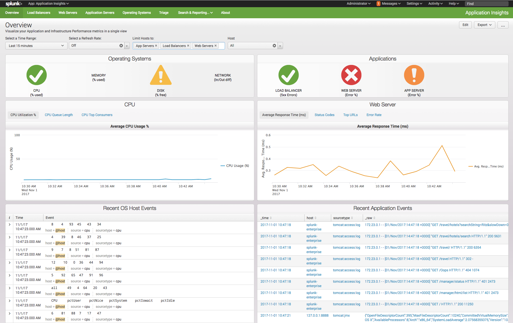
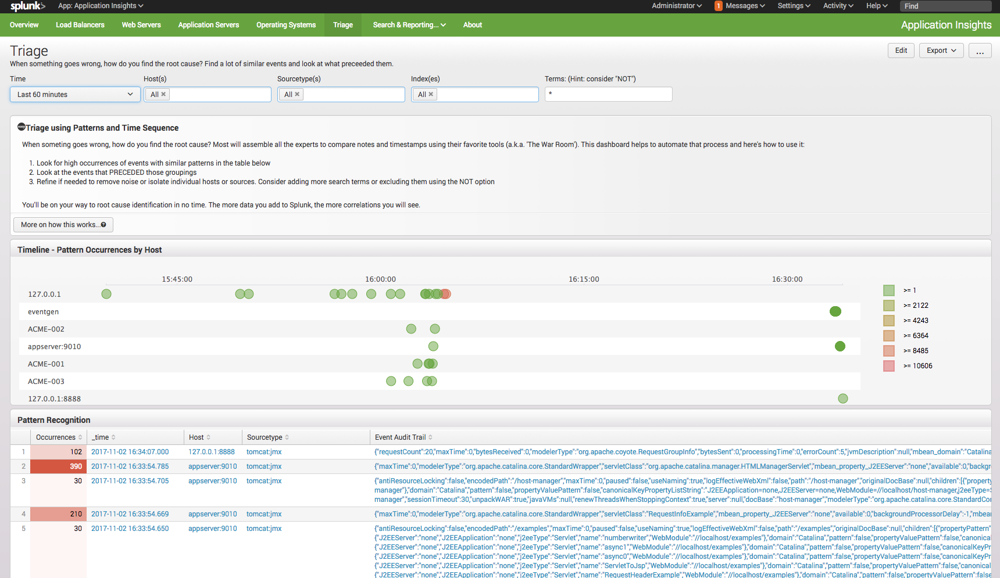

# splunk-application-insights
Splunk Insights for Application Monitoring

This Splunk app is designed to provide visualizations and correlations for many of the technologies used in the delivery of software applications.  It supports technologies such as Load Balancers, Web Servers, Applications Servers, JMX data and log files.  The goal is to provide a single point of entry for an operations or application support team responsible for various technologies.

The application also provides a Triage dashboard to help identify potential problem issues and create a timeline of events that occured just prior in an efort to quickly determine root cause.

### Sample Overview Dashboard

### Sample Triage Dashboard

